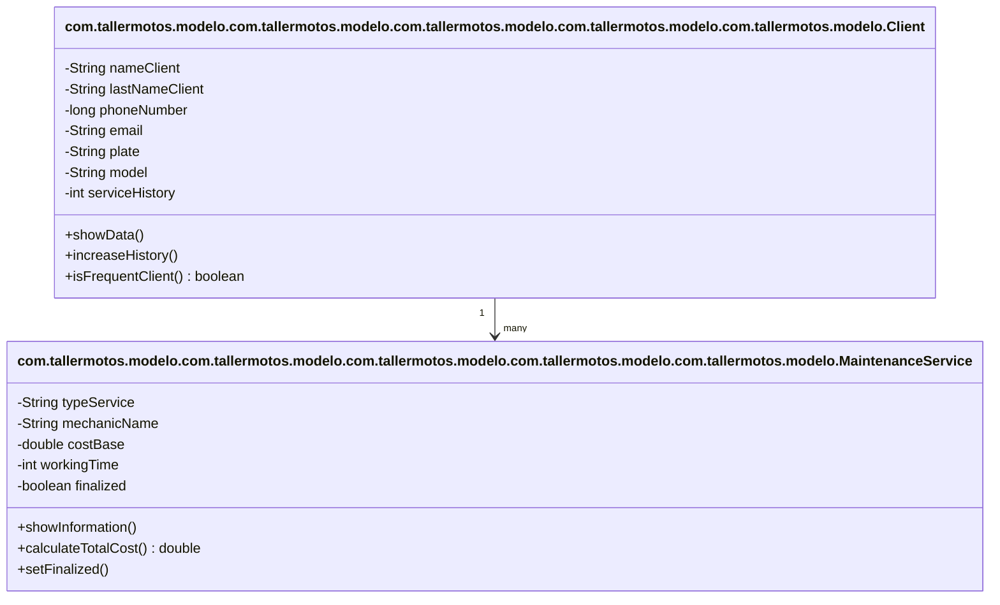

# Análisis del Dominio: "Taller de Motos "Velocidad Segura"

## 1. Identificación de Objetos

### Objeto Principal: `com.tallermotos.modelo.com.tallermotos.modelo.com.tallermotos.modelo.com.tallermotos.modelo.com.tallermotos.modelo.MaintenanceService` (Servicio de Mantenimiento)
**Justificación:**  
Es el objeto central del dominio porque representa el servicio principal que ofrece el taller. Modela la actividad esencial del negocio: realizar mantenimiento y reparaciones a motocicletas.

**Atributos Identificados:**

| Atributo | Tipo | Descripción |
|----------|--------|-------------------------------|
| `typeService` | String | Tipo de servicio solicitado (ej.: “Cambio de aceite”). |
| `mechanicName` | String | Nombre del técnico que realiza el trabajo. |
| `costBase` | double | Precio inicial del servicio. |
| `workingTime` | int | Horas empleadas en la reparación. |
| `finalized` | boolean | Indica si el servicio está finalizado o en proceso. |

**Comportamientos (Métodos):**

| Método | Descripción |
|--------|-------------------------------|
| `showInformation()` | Muestra los datos del servicio en consola. |
| `calculateTotalCost()` | Calcula el costo final del servicio incluyendo mano de obra. |
| `setFinalized()` | Permite actualizar el estado del servicio (finalizado o no). |

---

### 👤 Objeto Secundario: `com.tallermotos.modelo.com.tallermotos.modelo.com.tallermotos.modelo.com.tallermotos.modelo.com.tallermotos.modelo.Client` (Cliente)

**Justificación:**  
Representa a la persona que solicita los servicios del taller. Es necesario para registrar información del cliente, su moto y la frecuencia con la que usa el servicio.

**Atributos Identificados:**

| Atributo | Tipo | Descripción |
|----------|--------|-------------------------------|
| `nameClient`, `lastNameClient` | String | Datos personales del cliente. |
| `phoneNumber`, `email` | long / String | Información de contacto del cliente. |
| `plate`, `model` | String | Datos de la motocicleta: placa y marca/modelo. |
| `serviceHistory` | int | Cantidad de servicios que el cliente ha realizado en el taller. |

**Comportamientos (Métodos):**

| Método | Descripción |
|--------|-------------------------------|
| `showData()` | Muestra información del cliente y su motocicleta. |
| `increaseHistory()` | Incrementa la cantidad de servicios realizados por el cliente. |
| `isFrequentClient()` | Determina si es cliente frecuente (3 o más servicios → retorna `true`). |

---

### 🔗 Relación con el Objeto Principal

- La clase `com.tallermotos.modelo.com.tallermotos.modelo.com.tallermotos.modelo.com.tallermotos.modelo.com.tallermotos.modelo.MaintenanceService` representa un servicio realizado por el taller.
- La clase `com.tallermotos.modelo.com.tallermotos.modelo.com.tallermotos.modelo.com.tallermotos.modelo.com.tallermotos.modelo.Client` representa al dueño de la motocicleta que solicita el servicio.
- En el mundo real, un **Cliente puede tener varios servicios realizados**, pero un **Servicio pertenece a un único Cliente**.

**Tipo de relación:** Asociación (1 Cliente → N Servicios)

## 2. Diagrama de Clases (Opcional)

## 3. Decisiones de Diseño

### ¿Por qué elegí estos atributos?

Los atributos definidos representan la información mínima necesaria para modelar un servicio real dentro de un taller de motocicletas:

- **typeService, mechanicName:** Permiten identificar qué servicio se realizó y quién lo ejecutó.
- **costBase, workingTime:** Son esenciales para calcular el costo total, considerando tanto el servicio como la mano de obra.
- **finalized:** Indica el estado del servicio, lo que permite saber si está en proceso o ya fue entregado al cliente.

En el objeto **com.tallermotos.modelo.com.tallermotos.modelo.com.tallermotos.modelo.com.tallermotos.modelo.com.tallermotos.modelo.Client**, los atributos permiten identificar plenamente al cliente y su motocicleta, así como su historial de servicios para conocer su fidelidad al taller.

### ¿Qué validaciones implementé?

- Se validó si un cliente es frecuente mediante el método **isFrequentClient()**, el cual determina si tiene 3 o más servicios realizados.
- Se evitó el acceso directo a atributos sensibles mediante encapsulamiento (uso de getters y setters), lo que previene que datos como teléfono o correo se modifiquen incorrectamente.

### ¿Qué relaciones identifiqué?

- Existe una relación conceptual **Cliente → Servicio**, donde:
    - Un **Cliente puede tener múltiples servicios realizados** en el taller.
    - Un **Servicio pertenece únicamente a un Cliente**.
- Esta relación es de tipo **Asociación**, ya que ambos objetos pueden existir de forma independiente, pero se conectan para representar un caso real del negocio.

---

## 4. Dificultades Encontradas

- La primera dificultad fue definir claramente qué información debía tener cada clase sin mezclar responsabilidades. Se solucionó separando los datos del cliente y los datos del servicio.
- También hubo confusión inicial sobre dónde debía ir la lógica del descuento por fidelidad. Se resolvió ubicándola en la clase `com.tallermotos.modelo.com.tallermotos.modelo.com.tallermotos.modelo.com.tallermotos.modelo.com.tallermotos.modelo.Client`, ya que es el cliente quien puede ser frecuente, no el servicio.
- Finalmente, adaptar los métodos para que fueran útiles y coherentes con un proceso real de taller requirió analizar el flujo real de atención al cliente.

## 5. Comparación: POO vs Programación Estructurada

### Sin POO (Estructurado)

Sin programación orientada a objetos, la información del cliente y de los servicios estaría separada en múltiples variables y funciones sueltas.  
No habría una estructura clara que agrupe los datos y el comportamiento.

Ejemplo del enfoque estructurado:

- Variables independientes para cada dato del servicio: tipo, costo, horas, estado.
- Variables independientes para cada cliente: nombre, celular, historial.
- Funciones separadas para calcular costos o validar clientes, sin relación directa con los datos.

Esto genera problemas como:
- Duplicación de código.
- Dificultad para mantener y escalar el sistema.
- Riesgo de errores al manejar datos sin estructura.

### Con POO

Con la Programación Orientada a Objetos, los datos se organizan dentro de clases que representan objetos del mundo real.  
Los atributos y métodos están encapsulados dentro de cada clase, haciendo que el código sea más fácil de entender y mantener.

Beneficios aplicados:
- La clase `com.tallermotos.modelo.com.tallermotos.modelo.com.tallermotos.modelo.com.tallermotos.modelo.com.tallermotos.modelo.MaintenanceService` agrupa la información del servicio y calcula su costo total.
- La clase `com.tallermotos.modelo.com.tallermotos.modelo.com.tallermotos.modelo.com.tallermotos.modelo.com.tallermotos.modelo.Client` almacena los datos del cliente y determina si es frecuente.
- Se modela la relación entre objetos de forma más natural y cercana a la realidad.

### Ventajas específicas en mi dominio

1. **Organización del negocio más realista:** Cada cliente y cada servicio se representan como objetos, igual que en un taller real.
2. **Fácil escalabilidad:** Si se desea agregar facturación, inventario o historial detallado, se pueden crear nuevas clases sin modificar las ya existentes.
3. **Reutilización del código:** Los métodos como `calculateTotalCost()` o `isFrequentClient()` pueden usarse en cualquier parte del sistema sin volver a escribir la lógica.
