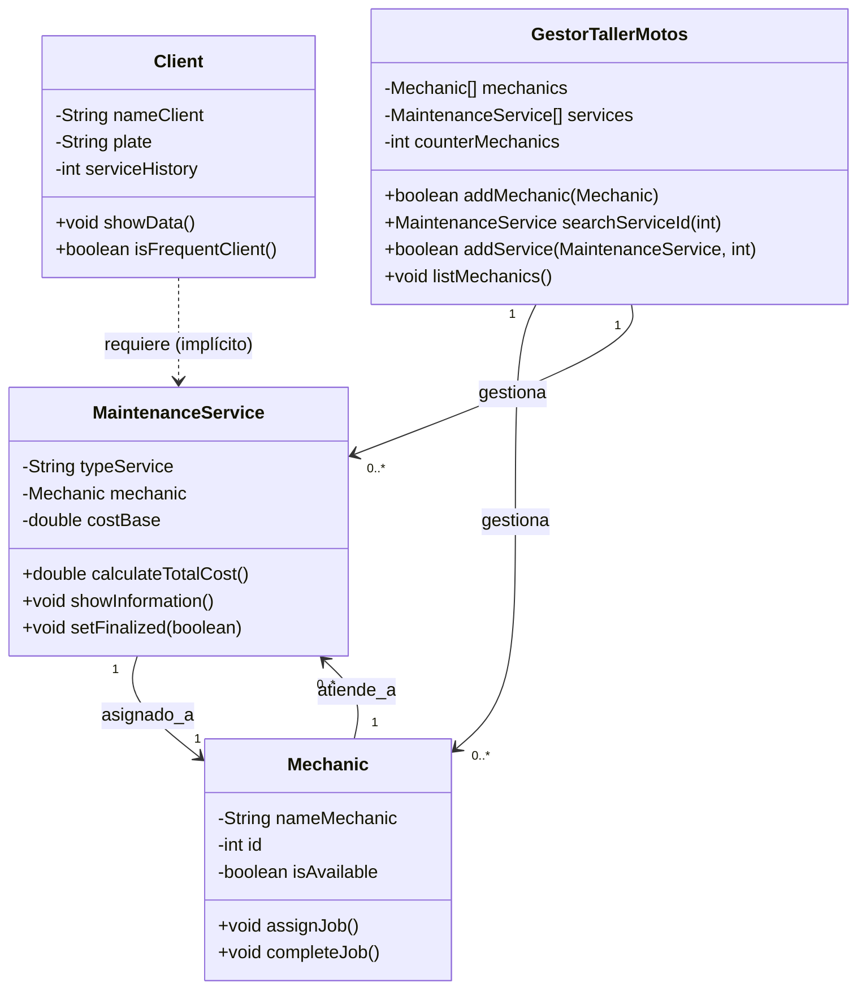

# Análisis OO - Semana 02: "Taller de Motos "Velocidad Segura"

## 1. Evolución del Modelo
El dominio del sistema es la **Gestión de Órdenes de Mantenimiento en un Taller de Motos**, y nueva clase **Mechanic**.
### Semana 01 (Recap)
- **Clase MaintenanceService:** Representa la orden de trabajo para una moto. Almacena el tipo de servicio, el costo, el tiempo de trabajo, y calcula el costo total.
- **Clase Client:** Representa al dueño de la moto. Almacena sus datos personales, la información de la moto, e historial de servicios.

### Semana 02 (Nuevas adiciones)
- **Clase Mechanic:** Representa al personal del taller. Gestiona su disponibilidad (`isAvailable`) y su historial de trabajos completados.
- **Clase GestorTallerMotos:** Clase Sistema/Gestor - Encargada de gestionar y coordinar los objetos de tipo `Mechanic` y `MaintenanceService`. Centraliza la lógica de negocio como agregar, buscar, listar, contar y asignar órdenes.
- **Relación bidireccional entre `MaintenanceService` y `Mechanic`:** Se establece explícitamente una relación de asignación de trabajo, donde el servicio tiene un mecánico asignado y el mecánico tiene métodos para ser asignado/liberado por un trabajo.

---

## 2. Nueva Clase: En la Semana 02 se añade formalmente la clase `Mechanic` para gestionar al personal del taller.

### Justificación
¿Por qué es necesaria esta tercera clase?
¿Qué problema del dominio resuelve?

La clase `Mechanic` es necesaria para modelar a los mecánicos que realizan los servicios. Permite controlar su disponibilidad, historial de trabajos y asignar órdenes de manera estructurada.

### Atributos

| Atributo | Tipo | Descripción |
|----------|------|-------------------------------|
| `nameMechanic` | String | Nombre del mecánico. |
| `id` | int | Identificador único para cada mecánico. |
| `specialization` | String | Especialidad del mecánico (ej.: Frenos, Aceite, Llantas). |
| `isAvailable` | boolean | Indica si el mecánico está disponible para una nueva tarea. |
| `completedJobsCount` | int | Contador de trabajos finalizados. |

| Método                                              | Descripción                                                                                 | Ejemplo de Uso                                                            |
| --------------------------------------------------- | ------------------------------------------------------------------------------------------- | ------------------------------------------------------------------------- |
| `assignJob()`                                       | Asigna una tarea al mecánico. Cambia su estado a no disponible y muestra mensaje.           | `mechanic.assignJob();`                                                   |
| `completeJob()`                                     | Finaliza un trabajo. Incrementa el contador de trabajos completados y lo vuelve disponible. | `mechanic.completeJob();`                                                 |
| `checkAvailability()`                               | Retorna `true` si el mecánico está disponible para un nuevo trabajo.                        | `boolean disponible = mechanic.checkAvailability();`                      |
| `getNameMechanic()` / `setName(String)`             | Obtiene o modifica el nombre del mecánico.                                                  | `mechanic.getNameMechanic();` / `mechanic.setName("Juan");`               |
| `getId()` / `setId(int)`                            | Obtiene o modifica el ID del mecánico.                                                      | `mechanic.getId();` / `mechanic.setId(101);`                              |
| `getSpecialization()` / `setSpecialization(String)` | Obtiene o modifica la especialización.                                                      | `mechanic.getSpecialization();` / `mechanic.setSpecialization("Aceite");` |
| `isAvailable()` / `setAvailable(boolean)`           | Obtiene o modifica la disponibilidad del mecánico.                                          | `mechanic.isAvailable();` / `mechanic.setAvailable(false);`               |
| `getCompletedJobsCount()`                           | Retorna el número de trabajos completados.                                                  | `int trabajos = mechanic.getCompletedJobsCount();`                        |

### Relaciones
- Con `MaintenanceService`: Relación bidireccional. Un `MaintenanceService` tiene un mecánico asignado y un `Mechanic` puede atender múltiples órdenes.
- Con `Client`: La relación es indirecta/mediada por `MaintenanceService`. El mecánico atiende servicios que pertenecen a un cliente, por lo que se establece una relación funcional entre `Mechanic` y `Client` a través de la orden de servicio.
- Con `GestorTallerMotos`: El gestor administra los objetos `Mechanic`, agregando nuevos mecánicos y asignando trabajos.

---

## 3. Clase Sistema/Gestor (GestorTallerMotos)

### Responsabilidades
- **Gestión de Mecánicos:** Agregar nuevos mecánicos (`addMechanic`).
- **Gestión de Órdenes:** Agregar órdenes de servicio y asignarlas a un mecánico disponible (`addService`).
- **Consulta y Reportes:** Listar el estado de los mecánicos (`listMechanics`) y contar órdenes en proceso (`countServiceInProcess`).
- **Búsqueda:** Encontrar una orden de servicio por su ID (`searchServiceId`).

### Decisiones de Diseño
- **Arrays vs. Colecciones:** Se usan arrays de tamaño fijo (`Mechanic[]` y `MaintenanceService[]`) por simplicidad inicial; en práctica real, se usaría `ArrayList`.
- **Capacidad máxima:** `MAX_MECHANICS = 20` y `MAX_SERVICES = 100`.
- **Búsquedas:** Se realiza un recorrido lineal con `for` comparando IDs.

### Métodos Clave
- `addMechanic(Mechanic m)`: Agrega el mecánico al array si hay espacio.
- `searchServiceId(int id)`: Retorna la orden con ID coincidente o `null`.
- `addService(MaintenanceService o, int mId)`: Agrega la orden, busca al mecánico, verifica disponibilidad y asigna la orden.
- `listMechanics()`: Muestra nombre, especialización y disponibilidad de cada mecánico.

---

## 4. Diagrama de Relaciones

---

## 5. Mejoras Respecto a Semana 01

### Funcionalidades Nuevas
- **Gestión Centralizada:** La clase `GestorTallerMotos` centraliza la lógica de negocio.
- **Asignación de Servicio y Gestión de Estado:** `addService` asigna mecánico y actualiza estados.
- **Búsqueda Funcional:** `searchServiceId` recupera órdenes por ID.

### Conceptos Aplicados
- **Encapsulación mejorada:** atributos `private`, getters y setters públicos donde se requieren.
- **Uso de arrays:** para gestionar objetos.
- **Implementación de búsqueda lineal:** sobre arrays.
- **Gestión coordinada de múltiples objetos:** interacción entre `Mechanic` y `MaintenanceService`.

---

## 6. Dificultades y Soluciones

## 6. Dificultades y Soluciones

### Dificultad 1: Problemas de conocimiento.
- **Descripción:**
    - Falta de conocimiento sobre todas las clases y métodos al inicio del proyecto.
    - La gran cantidad de información en el código puede causar confusión, por lo que a veces es necesario releer varias veces para entender la lógica.
- **Solución:**
    - Revisar y documentar el código paso a paso.
    - Realizar diagramas y esquemas de relaciones para visualizar mejor la interacción entre clases.
    - Tomarse tiempo para comprender la secuencia de métodos y el flujo de datos antes de modificar o agregar funcionalidades.

### Dificultad 2: Relación de Asignación y Control de Estado
- **Descripción:** Coordinar que un mecánico tenga solo una tarea activa es complejo.
- **Solución:** `GestorTallerMotos.addService()`:
    1. Busca al mecánico por ID.
    2. Verifica `isAvailable()`.
    3. Llama a `assignJob()` y asigna el mecánico a la orden.

### Dificultad 3: Manejo de Colecciones
- **Descripción:** Arrays fijos requieren control de índices.
- **Solución:** Se usan contadores (`counterMechanics`, `counterServices`) y máximos (`MAX_MECHANICS`, `MAX_SERVICES`) para evitar errores de inserción.

---

## 7. Próximos Pasos (Semana 03)
- Reemplazar arrays por **ArrayList** para mayor flexibilidad.
- Mejorar encapsulación en `GestorTallerMotos`.
- Validar IDs de mecánicos y servicios.
- Modelar explícitamente la relación de `MaintenanceService` con `Client`.